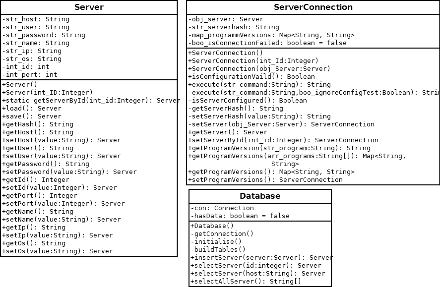

# ServerViewer

School AS Project

## Project Setup:

* using eclipse:
* install the javafx tools via `Help -> Install new Software`
* install the Package `e(fx)clipse - Minimal JavaFX OSGi integration bundles`
* clone the Repository and open it within the Package Explorer
* Add the JavaFX Dependency as a library
    * Right Click the Project and go to Preperties
    * JavaBuildPath -> Libraries -> Select Module Path -> Add Libary
    * User Library -> User Libraries -> Create a new Library and add the javafx jars from the lib folder
* {Linux} export PATH_TO_FX=path/to/repository/lib/javafx-sdk-15.0.1/lib [source](https://openjfx.io/openjfx-docs/#install-javafx)
* In `Run Configurations` at `Arguments` enter the following into VM Arguments [source](https://openjfx.io/openjfx-docs/#install-javafx):
* `--module-path /path/to/javafx-sdk-15.0.1/lib --add-modules javafx.controls,javafx.fxml`
  

# Class Diagrams v1

